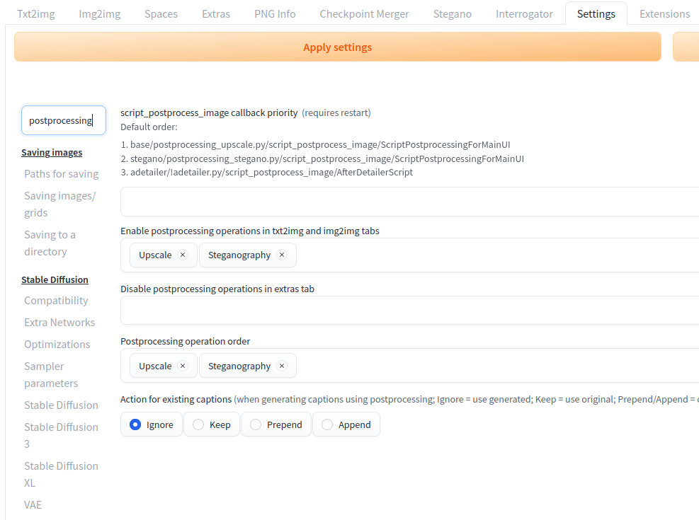

# Steganographic Extension for Automatic1111 and Forge

## Overview

This extension provides functionality for embedding and extracting hidden messages in images using Least Significant Bit (LSB) Steganography. It supports JPEG and PNG formats and integrates with the Automatic1111 web UI.

The core functionality allows users to hide text messages within image files, utilizing the Discrete Cosine Transform (DCT) coefficients for JPEGs and pixel data for PNGs. The extension is designed to minimize impact on image quality while embedding messages.

## Features

- **JPEG Steganography**: Hide and extract messages in JPEG images by modifying the DCT coefficients.
- **PNG Steganography**: Hide and extract messages in PNG images by modifying pixel data.
- **Seed-Based Shuffling**: Uses a seed to shuffle embedding positions, increasing the difficulty of unauthorized extraction.
- **Automatic1111 Integration**: Seamlessly integrates into the Automatic1111 web UI for ease of use.
- **Verification**: Automatic verification that the embedded and extracted messages match.

## How It Works

### Message Embedding

1. **Message Conversion**: The input message is converted into binary format.
2. **DCT Coefficient Selection (JPEG)**: Coefficients that minimally impact image quality are selected for modification.
3. **Pixel Selection (PNG)**: Pixels are selected based on a pseudorandom order defined by the seed.
4. **Embedding**: The message is embedded by modifying the least significant bits of the selected coefficients or pixels.
5. **Verification**: After embedding, the message is extracted and compared to the original for verification.

### Message Extraction

1. **Seed-Based Retrieval**: The same seed used for embedding is required to retrieve the message.
2. **Reversal of Embedding**: The message is extracted by reversing the shuffling and reading the least significant bits.

## Installation

1. Clone this repository into the `extensions` directory of your Automatic1111 installation:
    ```bash
    git clone https://github.com/yourusername/stegano-extension.git extensions/stegano-extension
    ```

2. Restart the Automatic1111 Web UI.

3. The Stegano extension will appear in the UI under the **Postprocessing** section.



## Usage

### Embedding a Message

1. **Upload an Image**: Choose a JPEG or PNG image to embed a message.
2. **Enter a Message**: Input the message to be hidden in the image.
3. **Provide a Seed**: Enter a numerical seed for shuffling the embedding positions.
4. **Click Embed**: The message will be embedded, and a download link will be provided for the modified image.

### Extracting a Message

1. **Upload the Image**: Choose the image that contains the hidden message.
2. **Enter the Seed**: Use the same seed that was provided during the embedding process.
3. **Click Reveal**: The hidden message will be extracted and displayed.

## License

This project is licensed under the MIT License. See the [LICENSE](LICENSE) file for details.

```plaintext
MIT License

Copyright (c) 2020 Daniel Lerch Hostalot. All rights reserved.
Implementation for Automatic 1111 & PNG steganography Copyright (c) 2024 Aniello Di Meglio. All rights reserved.

